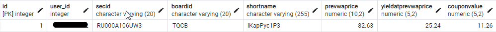
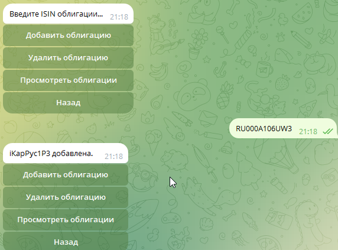
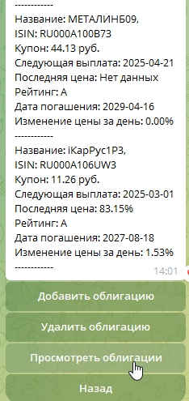
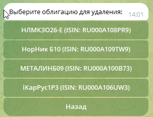

#### Телеграм бот парсер московской, возможность добавлять свои избранные облигации или акции для дальнейшего отслеживания различных показателей.
#### (Версия бота в стадии разработки, доступны только облигации)
Для каждого пользователя в базу данных сохраняются свои ценные бумаги.

Основные библиотеки aiogram3+, fastApi, postgreSQL

Для работы бота требуется:

1. Создать в телеграмм своего бота https://t.me/BotFather для получения токена
2. Установить docker и запустить его
3. Создать файл .env и внести в него данные из шаблона .env.sample
4. Запустить бота собрав контейнеры docker-compose up --build

- отображение в базе данных

- Пример работы

