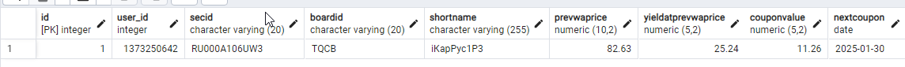
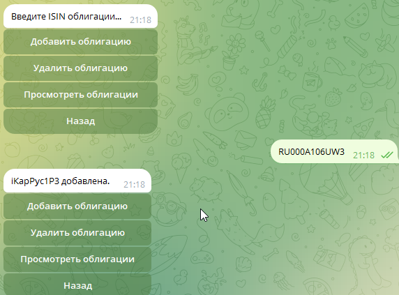
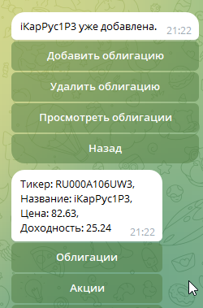

#### Телеграм-бот-парсер московской биржи, с возможностью добавлять облигации или акции в избранное для дальнейшего отслеживания различных показателей.
#### (Версия бота в стадии разработки)

Для каждого пользователя в базу данных сохраняюся свои ценные бумаги.
Использованы библиотеки aiogram3+, FastApi, postgreSQL
- отображение в базе данных

- Пример работы
  

